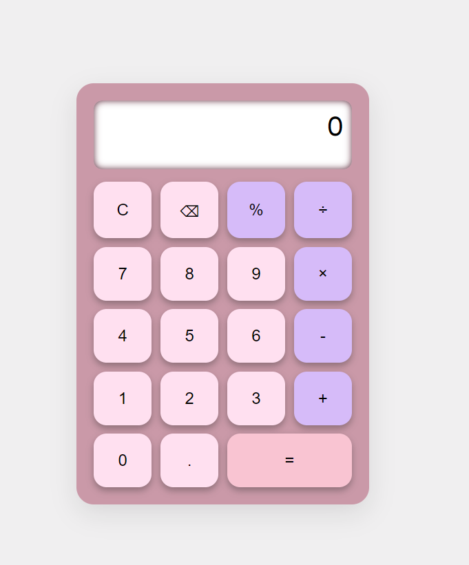

# simple-calculator
# 🧮 Simple Calculator

A basic calculator built using **HTML**, **CSS**, and **JavaScript** that performs simple arithmetic operations: addition, subtraction, multiplication, and division. Clean UI with responsive layout — perfect for beginners!

---

## 🚀 Features

- Perform basic operations: `+`, `-`, `×`, `÷`
- Clear and responsive UI
- Mobile-friendly layout
- Light animation on buttons for interaction feedback

## 🛠️ Tech Stack

- **HTML** – Structure of the calculator
- **CSS** – Styling and layout
- **JavaScript** – Logic behind calculations and button functionality

---
## 📸 Preview

  

